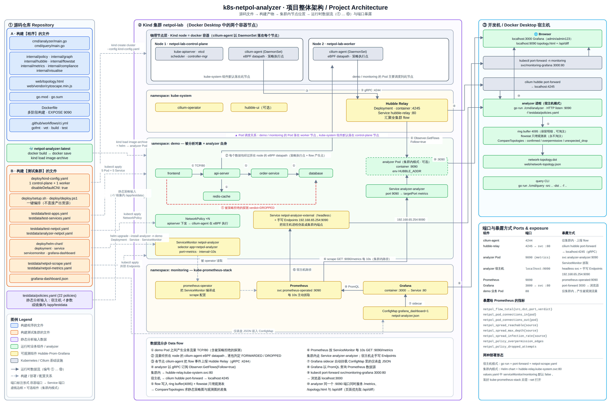
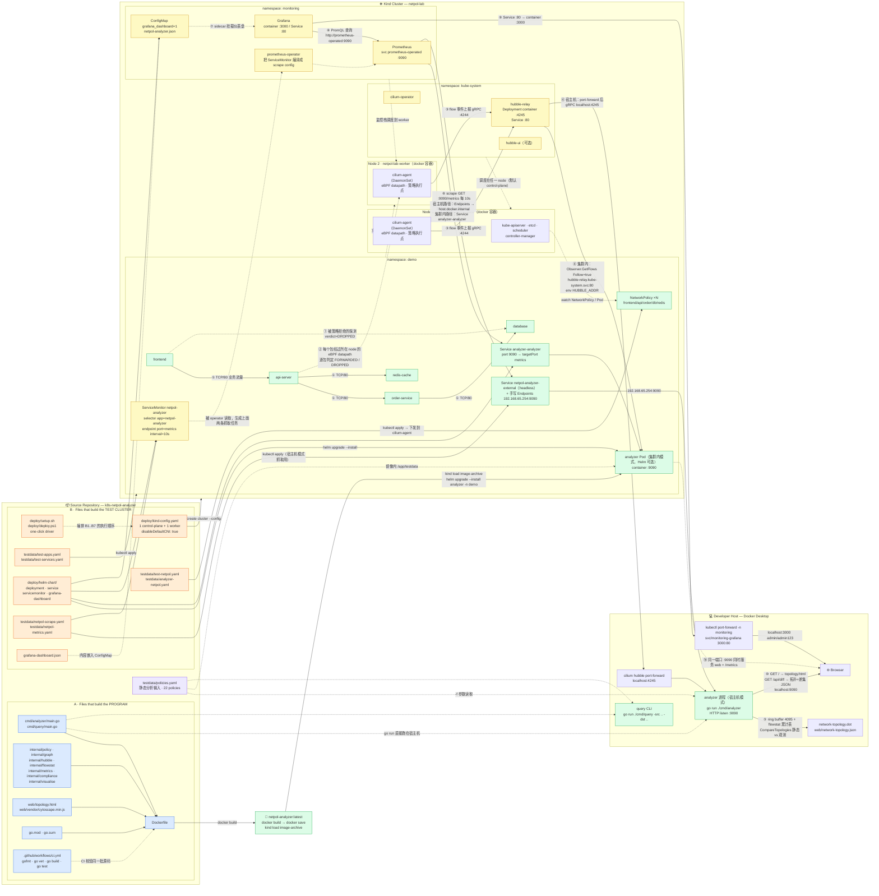

# 项目整体架构图 / Project Architecture

一张图说明四件事：

1. 哪些文件用于**构建程序**（Go 二进制 / 容器镜像）——图中蓝色 `A` 组；
2. 哪些文件用于**构建测试集群**（Kind + Cilium + 测试应用 + 监控栈）——图中橙色 `B` 组；
3. 各节点在集群内部的**位置关系**——两个 Kind node 容器、三个 namespace，以及谁调度到哪里；
4. 数据**如何在节点之间流动**——从 Pod 流量 → eBPF datapath → Hubble Relay → analyzer → Prometheus → Grafana → 浏览器，每条边都标注了端口与协议（图中 ① … ⑩）。

---

## 总览图

> 点击图片可打开矢量版 [`architecture.svg`](architecture.svg)（可无损放大）。
> 图由 [`docs/gen_architecture.py`](gen_architecture.py) 生成：
> `python3 docs/gen_architecture.py` 会重写 `docs/architecture.svg`。
> 需要更新结构时改脚本再重新生成，不要手改 SVG。

---

## 图例

| 颜色 | 含义 |
|---|---|
| 🔵 蓝 | 构建**程序**的文件：Go 源码、前端静态资源、`go.mod`、`Dockerfile`、CI |
| 🟠 橙 | 构建**测试集群**的文件：Kind 配置、部署脚本、测试应用/服务/策略、Helm chart、抓取配置、仪表盘 |
| 🟣 紫 | 分析输入数据：`testdata/policies.yaml` |
| 🟢 绿 | 运行时业务组件（被分析对象 + analyzer 自身） |
| 🟡 黄 | 可观测组件（Hubble / Prometheus / Grafana / operator） |
| 实线 | 运行时数据流动 |
| 虚线 | 构建期、配置期或调度关系 |

---

## 端口与暴露方式一览

| 组件 | 容器端口 | Service 端口 | 对外暴露方式 | 协议 / 用途 |
|---|---|---|---|---|
| cilium-agent | 4244 | — | 仅集群内 | gRPC，向 hubble-relay 上报 flow |
| hubble-relay | 4245 | `hubble-relay.kube-system.svc:80` | `cilium hubble port-forward` → `localhost:4245` | gRPC `Observer.GetFlows(Follow=true)` |
| analyzer（集群内） | 9090 (`metrics`) | `analyzer-analyzer:9090` | ServiceMonitor 抓取；`kubectl port-forward` 看 web | HTTP：`/`、`/api/diff`、`/metrics` |
| analyzer（宿主机） | `localhost:9090` | headless `netpol-analyzer-external` + 手写 Endpoints `192.168.65.254:9090` | Prometheus 反向抓宿主机 | 同上 |
| Prometheus | 9090 | `prometheus-operated:9090` | 集群内 Grafana 直连 | PromQL |
| Grafana | 3000 | `monitoring-grafana:80` | `kubectl port-forward … 3000:80` → `localhost:3000` | Web UI |
| demo 业务 pod | 80 | `frontend/api-server/order-service/database/redis-cache:80` | 仅集群内 | HTTP，产生被观测的流量 |

---

## 数据流分步说明（对应图中 ①–⑩）

1. **业务流量产生**：`demo` namespace 里 5 个 nginx pod 按 `frontend → api-server → order-service → database`、`api-server → redis-cache` 的链路互访；人为构造的越权探测会被策略拒绝。
2. **策略执行 + 观测点**：Kind 关闭了默认 CNI，由 `cilium-agent`（DaemonSet，每个 node 一个）在 eBPF datapath 上逐包判定 `FORWARDED` / `DROPPED`，这里同时是策略执行点和 flow 产生点。
3. **flow 汇聚**：各 node 的 `cilium-agent` 把 flow 事件推给 `kube-system/hubble-relay`。
4. **analyzer 订阅**：analyzer 作为 gRPC 客户端调用 `Observer.GetFlows(Follow=true)`。集群内模式走 `hubble-relay.kube-system.svc.cluster.local:80`（由 Helm 的 `HUBBLE_ADDR` 环境变量注入）；宿主机模式走 `cilium hubble port-forward` 暴露的 `localhost:4245`。
5. **两级存储与比对**：flow 先进 4095 条的 ring buffer（保留明细、允许淘汰），同时按边累加进 `internal/flowstat` 的只增观测表（永不淘汰，否则低频边会被高频流量冲刷成「从未使用」）。`graph.CompareTopologies` 把静态策略图与观测表做差集，得到 `confirmed` / `overpermissive` / `unexpected_drop` 三类边。
6. **Prometheus 抓取**：`ServiceMonitor` 被 prometheus-operator 编译成抓取任务，每 10s `GET :9090/metrics`。集群内模式经 `Service analyzer-analyzer`；宿主机模式经 `netpol-scrape.yaml` 里那组 headless Service + 手写 Endpoints，把 Docker Desktop 的宿主机地址 `192.168.65.254:9090` 伪装成集群内端点。
7. **仪表盘注入**：Helm 在 `monitoring` namespace 生成带 `grafana_dashboard: "1"` 标签的 ConfigMap，Grafana sidecar 自动挂载。
8. **Grafana 查询**：Grafana 以 Prometheus 为数据源，跑 `netpol_pod_connections_out`、`netpol_spread_infection_rate` 等 PromQL。
9. **Grafana 暴露**：`kubectl port-forward -n monitoring svc/monitoring-grafana 3000:80`，浏览器访问 `http://localhost:3000`。
10. **analyzer 自带 web 视图**：同一个 `:9090` 端口既服务 `/metrics`，也服务 `web/topology.html` 与 `/api/diff`；页面优先取 `/api/diff`（含实时观测），取不到时回退到静态导出的 `web/network-topology.json`。

---

## 暴露给 Prometheus 的指标

| Metric | Type | Labels |
|---|---|---|
| `netpol_flow_total` | Counter | `src`, `dst`, `port`, `verdict` |
| `netpol_pod_connections_in` | Gauge | `pod` |
| `netpol_pod_connections_out` | Gauge | `pod` |
| `netpol_spread_reachable` | Gauge | `source` |
| `netpol_spread_max_depth` | Gauge | `source` |
| `netpol_spread_infection_rate` | Gauge | `source` |
| `netpol_policy_overpermission_edges` | Gauge | — |
| `netpol_policy_dropped_attempts` | Gauge | — |

---

## 两种部署形态的区别

| | 宿主机模式（README 默认流程） | 集群内模式（Helm chart） |
|---|---|---|
| analyzer 位置 | 开发机进程 `go run ./cmd/analyzer` | `demo` namespace 里的 Pod |
| 连 Hubble | `localhost:4245`（port-forward） | `hubble-relay.kube-system.svc:80` |
| 被 Prometheus 抓取 | `testdata/netpol-scrape.yaml`：headless Service + 手写 Endpoints 指向宿主机 IP | `deploy/helm-chart/templates/service.yaml` + `servicemonitor.yaml` |
| 策略文件来源 | 本地 `testdata/policies.yaml` | 镜像内 `/app/testdata`（Dockerfile COPY） |
| 出网策略 | 不受集群策略约束 | 需要 `testdata/analyzer-netpol.yaml` 放行 egress |

> `serviceMonitor.enabled` 与 `monitoring.enabled` 在 `values.yaml` 中默认为 `false`；装好 kube-prometheus-stack 后需 `--set serviceMonitor.enabled=true --set monitoring.enabled=true` 才会生成 ServiceMonitor。

---

## 文件用途速查

### A. 构建程序

| 文件 | 作用 |
|---|---|
| `cmd/analyzer/main.go` | 入口：静态分析 → 启动采集 → `:9090` 服务 web/`/api/diff`/`/metrics` |
| `cmd/query/main.go` | 可达性查询 CLI |
| `internal/policy/parser.go` | NetworkPolicy YAML → 边 + 隔离状态 |
| `internal/graph/*` | 图类型、建边、BFS 传播、关键路径、割点、静态 vs 观测差集 |
| `internal/hubble/*` | Hubble gRPC 客户端；flow → 图节点解析 |
| `internal/flowstat/tracker.go` | 只增观测边表 |
| `internal/metrics/metrics.go` | Prometheus 指标定义与 HTTP server |
| `internal/compliance/compliance.go` | 6 条合规规则检查 |
| `internal/visualise/*` | Graphviz DOT 与 JSON 导出 |
| `web/topology.html`, `web/vendor/cytoscape.min.js` | 前端拓扑视图（Cytoscape 已 vendor，集群内通常无 CDN 出网） |
| `go.mod` / `go.sum` | 依赖：cilium、prometheus client、grpc、yaml.v3 |
| `Dockerfile` | 多阶段构建，产物 `netpol-analyzer:latest`，`EXPOSE 9090` |
| `.github/workflows/ci.yml` | gofmt / vet / build / test / docker build |

### B. 构建测试集群

| 文件 | 作用 |
|---|---|
| `deploy/kind-config.yaml` | 1 control-plane + 1 worker，`disableDefaultCNI: true` 给 Cilium 让位 |
| `deploy/setup.sh` / `deploy/deploy.ps1` | 一键流程：建集群 → 预载镜像 → 装 Cilium → apply 测试资源 → 装监控 → 构建并 helm 部署 analyzer |
| `testdata/test-apps.yaml` | `demo` namespace 与 5 个 nginx pod |
| `testdata/test-services.yaml` | 5 个 ClusterIP Service（:80） |
| `testdata/test-netpol.yaml` | demo 链路的 NetworkPolicy |
| `testdata/analyzer-netpol.yaml` | 放行 analyzer Pod 的 egress |
| `deploy/helm-chart/**` | Deployment / Service / ServiceMonitor / Grafana dashboard ConfigMap |
| `testdata/netpol-scrape.yaml` | 宿主机模式下让 Prometheus 抓宿主机 `:9090` |
| `testdata/netpol-metrics.yaml` | 同类抓取配置的 ExternalName 变体 |
| `grafana-dashboard.json` | 版本化的 Grafana 仪表盘 |
| `testdata/policies.yaml` | 静态分析的默认输入（22 条策略），不参与集群构建 |

---

## 附录：可编辑的 Mermaid 版本

上面的 SVG 是手工排版的，信息更密；下面这份 Mermaid 源码信息一致但由自动布局渲染，
便于在 GitHub / 编辑器里直接改动。

展开 Mermaid 源码

